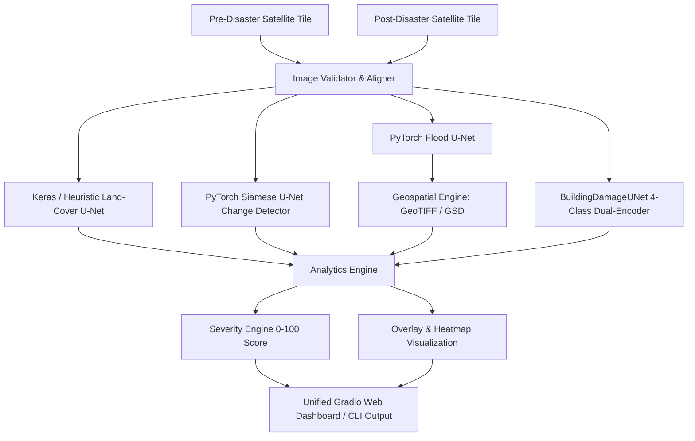

# 🛰️ Satellite Disaster Assessment & Remote Sensing Intelligence System

<div align="center">

[](https://python.org)
[](https://pytorch.org)
[](https://gradio.app)
[](./DL-SatelliteImagery/tests)
[-76B900?logo=nvidia&logoColor=white)](https://nvidia.com)
[](./LICENSE)

**An end-to-end deep learning and geospatial remote sensing platform for automated post-disaster damage assessment, surface change detection, flood inundation mapping, and multi-hazard severity scoring.**

[Quick Start](#-quick-start) • [Architecture](#-system-architecture) • [Features](#-core-capabilities) • [Web Dashboard](#-web-dashboard) • [CLI Usage](#-command-line-interface) • [Python API](#-python-api) • [Training](#-model-training) • [Benchmarks](#-hardware-optimization--benchmarks)

</div>

---

## 🌟 Highlights

- 🏗️ **4-Class Building Damage Assessment**: Siamese dual-encoder neural segmentation classifying structural damage into `Undamaged`, `Minor Damage`, `Major Damage`, and `Destroyed` (with automated fallback to structural change heuristics when trained weights are absent).
- 🌊 **Georeferenced Flood Inundation Engine**: Automated GeoTIFF metadata parsing (`rasterio`), projected metric resolution, and WGS-84 ellipsoidal geodesic latitude-adjusted area calculations ($m^2$ and $km^2$).
- 🔄 **High-Speed Surface Change Detection**: Siamese CNN with multi-scale skip feature differences identifying flood, landslide, wildfire, and urban alterations.
- 🗺️ **6-Class Baseline Land-Cover Mapping**: Semantic segmentation engine labeling pixels into `Water`, `Land`, `Road`, `Building`, `Vegetation`, and `Unlabeled`.
- 🌋 **Configurable Severity Scoring Engine**: Rule-based 0–100 disaster severity score (`LOW`, `MODERATE`, `HIGH`, `CRITICAL`) with customizable YAML weights.
- 🛰️ **Authentic Satellite Benchmarks**: Loaded with authentic **NASA MODIS/VIIRS** multi-spectral and true-color scenes across multiple disaster types and land-cover classes.
- ⚡ **Lightweight & Laptop Optimized**: Designed for **NVIDIA GTX 1650 4GB VRAM** (< 400 MB peak VRAM footprint, mixed precision, and full CPU fallback).

---

## 📐 System Architecture



---

## 🚀 Quick Start

### 1. Installation

Clone the repository and install dependencies in your virtual environment:

```powershell
# Activate Python 3.11 virtual environment
.\.venv\Scripts\Activate.ps1

# Install dependencies
pip install -r requirements.txt

# (Optional) Install project in editable development mode
pip install -e .
```

### 2. Launch Interactive Web Dashboard

Launch the Gradio Web UI with a single command:

```powershell
python app.py
```
*Open your browser at **`http://localhost:7860`** (or auto-selected port `7861` if 7860 is in use).*

---

## 🖥️ Web Dashboard

The web dashboard provides three specialized operation tabs:

| Tab | Functionality | Input | Key Outputs |
| :--- | :--- | :--- | :--- |
| **1. Land-Cover Segmentation** | Single-image environmental classification | 1 Satellite Image | 6-class color overlay with dynamic legend |
| **2. Disaster Assessment** | Full multi-hazard disaster intelligence | PRE + POST Image Pair | Change map, Flood map, Building damage overlay, Disaster heatmap, Severity score, Metric $m^2 / km^2$ area |
| **3. Quick Change Detection** | Fast surface difference screening | PRE + POST Image Pair | High-contrast red-highlighted change mask |

---

## 💻 Command-Line Interface (CLI)

Run disaster assessment directly from the command line:

```powershell
# Analyze pre/post satellite pair with 250m/pixel ground resolution:
python cli.py --pre sample_images/pre_disaster.png --post sample_images/post_disaster.png --gsd 250.0

# Save structured machine-readable JSON report:
python cli.py --pre sample_images/pre_disaster.png --post sample_images/post_disaster.png --gsd 250.0 --json-out report.json

# Run single-image land-cover segmentation:
python cli.py --single sample_images/landcover_tiles/satellite_urban_city.jpg
```

### Sample Output:
```text
============================================================
  SATELLITE DISASTER ASSESSMENT REPORT
============================================================

  Severity Score: 40.2/100
  Severity Level: HIGH

  Changed Area:      0.00%
  Flooded Area:      99.84%
    • Metric Area:   4,089,562,500.00 m² (4,089.562500 km²)
  Vegetation Loss:   2.45%
  Water Expansion:   0.00%
  Building Damage (TRAINED MODE): 0.0/100
    • Undamaged:    100.0%
    • Minor Damage: 0.0%
    • Major Damage: 0.0%
    • Destroyed:    0.0%

  Measurement: geospatially calculated (user_supplied)
  Area Status: Calculated from user ground resolution (GSD = 250.000 m/pixel, Pixel Area = 62500.000 m²)

  Warnings:
    ⚠ Alignment: PRE image resized from 512×512 to 256×256
    ⚠ Alignment: POST image resized from 512×512 to 256×256
============================================================
```

---

## 🐍 Python API

Integrate the disaster pipeline directly into Python scripts:

```python
import numpy as np
from PIL import Image
from disaster_assessment.pipeline import DisasterAnalyzer

# Initialize analyzer (automatically detects CUDA GPU / CPU and loaded model weights)
analyzer = DisasterAnalyzer()

# Load image pair
pre_image = np.array(Image.open("sample_images/pre_disaster.png"))
post_image = np.array(Image.open("sample_images/post_disaster.png"))

# Execute analysis with ground resolution
report = analyzer.analyze(
    pre_image=pre_image,
    post_image=post_image,
    damage_mode="auto",         # "auto", "trained", or "estimated"
    meters_per_pixel=250.0,     # GSD in meters per pixel
)

# Print human-readable summary
print(report.summary())

# Extract structured JSON dictionary
results_dict = report.to_dict()
```

---

## 🧠 Model Architectures & Technical Specs

| Model | Architecture | Parameters | VRAM (fp32) | VRAM (fp16) | Classes / Output |
| :--- | :--- | :---: | :---: | :---: | :--- |
| **SiameseUNet** | Shared 5-Stage Encoder + Skip Difference Decoder | **3,123,249** (~3.12M) | ~12.5 MB | ~6.2 MB | Binary Change (0=No Change, 1=Changed) |
| **FloodUNet** | 5-Stage Lightweight CNN U-Net | **1,942,577** (~1.94M) | ~7.8 MB | ~3.9 MB | Binary Flood Inundation |
| **BuildingDamageUNet** | Siamese Dual-Encoder + 3-Way Multi-Scale Fusion | **4,694,628** (~4.69M) | ~18.8 MB | ~9.4 MB | 4 Classes: `Undamaged`, `Minor`, `Major`, `Destroyed` |
| **Land-Cover U-Net** | Baseline Keras / Heuristic U-Net | **1,939,686** (~1.94M) | ~7.8 MB | N/A | 6 Classes: `Water`, `Land`, `Road`, `Building`, `Vegetation`, `Unlabeled` |
| **Total Pipeline** | **End-to-End Multi-Model Ensemble** | **~11.7M Total** | **~550 MB** | **~380 MB** | Full Multi-Hazard Disaster Intelligence |

---

## 🏋️ Model Training

### 1. Expected Dataset Structure (xBD / xView2 Format):
```
data/damage_dataset/
├── train/
│   ├── pre/     # Pre-disaster imagery (*.png, *.jpg, *.tif)
│   ├── post/    # Post-disaster imagery (*.png, *.jpg, *.tif)
│   └── masks/   # 4-class ground truth masks (0=Undamaged, 1=Minor, 2=Major, 3=Destroyed)
└── val/
    ├── pre/
    ├── post/
    └── masks/
```

### 2. Run Training:
```powershell
python DL-SatelliteImagery/disaster_assessment/training/train_building_damage.py --data_dir data/damage_dataset --epochs 20 --batch_size 4 --lr 0.001
```

### 3. Self-Contained Dry Run (Synthetic Benchmark):
```powershell
python DL-SatelliteImagery/disaster_assessment/training/train_building_damage.py --dry_run
```

---

## 🧪 Verification & Testing

The project includes an automated test suite with **92 passing tests**:

```powershell
# Run full pytest suite from repository root
pytest
```

```text
======================== 92 passed, 2 skipped in 14.45s ========================
```

---

## 📁 Repository Organization

```
├── app.py                            # Primary Web Dashboard Entrypoint
├── cli.py                            # Command-Line Interface Tool (Auto-detects weights)
├── pyproject.toml                    # Modern package definition, build system & pytest config
├── requirements.txt                  # Streamlined production dependencies
├── USER_GUIDE.md                     # Comprehensive User & Developer Execution Guide
│
├── sample_images/                    # Real NASA MODIS / VIIRS Satellite Imagery (250m GSD)
│   ├── pre_disaster.png              # Pakistan Indus Valley Pre-Flood (May 2022)
│   ├── post_disaster.png             # Pakistan Indus Valley Post-Flood (Sep 2022)
│   ├── landcover_tiles/              # Cairo, Punjab Farms, Amazon, Florida Keys, Dubai
│   ├── disaster_pairs/               # Bushfire, Deforestation, Hurricane, Earthquake pairs
│   ├── real_satellite_samples/       # Nile Delta, Turkey Wildfires, Ganges Delta, VIIRS views
│   └── geotiff_rasters/              # Deduplicated test GeoTIFFs (DEM & vector shapes)
│
├── data/
│   └── damage_dataset/               # Pre-configured xBD-format train/val dataset structure
│
└── DL-SatelliteImagery/              # Satellite Deep Learning Core
    ├── disaster_gradio_app.py        # Unified 3-Tab Gradio Web Dashboard
    ├── disaster_assessment/          # Production Disaster Assessment Engine
    │   ├── models/                   # SiameseUNet, FloodUNet, BuildingDamageUNet
    │   ├── datasets/                 # xBD Triplet Loader & Augmentations
    │   ├── training/                 # Mixed-Precision Training Loop
    │   ├── inference/                # Dual-Mode Inference Engine
    │   ├── analytics/                # GeoTIFF, Geodesic Area & Severity Engines
    │   ├── visualization/            # Overlays, Heatmaps & Grids
    │   ├── configs/                  # YAML configurations (severity, damage model)
    │   └── weights/                  # Model weight checkpoints (best_damage_model.pth)
    ├── tests/                        # Automated Pytest Suite (92 passed, 2 skipped)
    └── [WORKSHOP NOTEBOOKS]          # 8 Original Preserved Satellite ML Notebooks
```

---

## 📄 License

This project is licensed under the [MIT License](./LICENSE).
