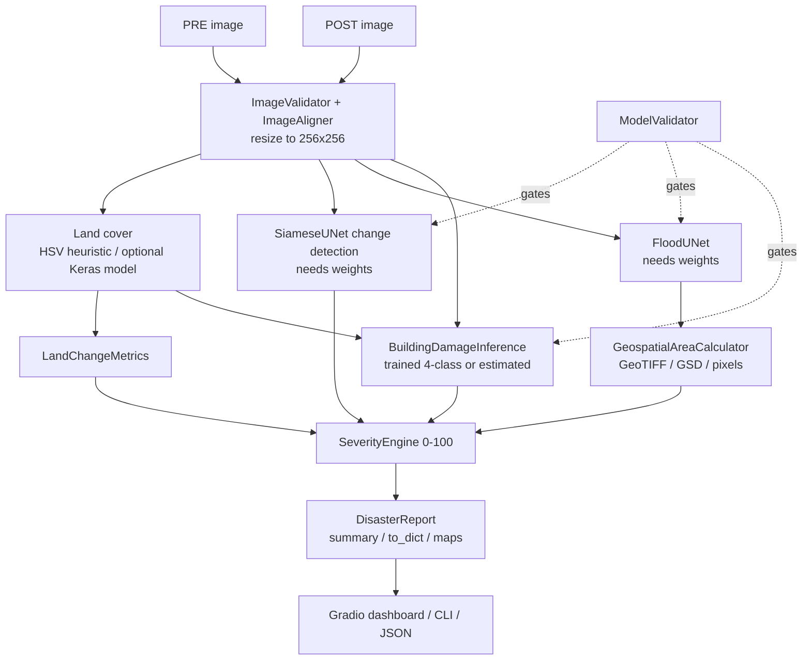
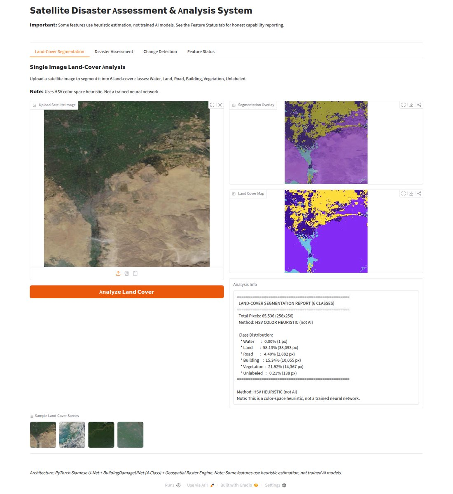
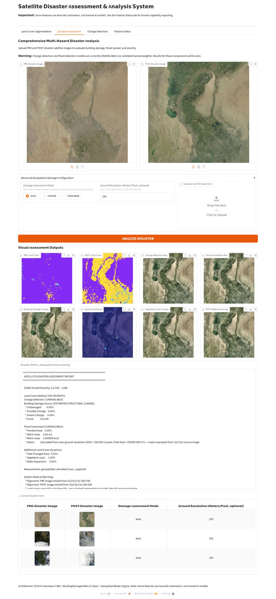
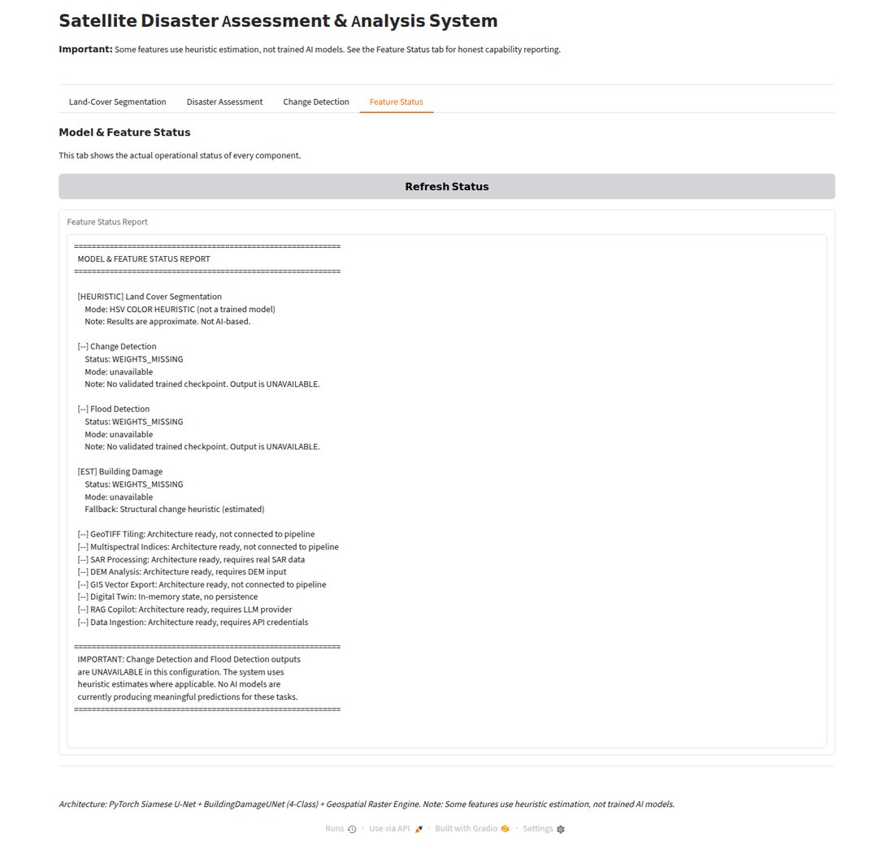

# 🛰️ Satellite Disaster Assessment & Remote Sensing Toolkit

[](https://github.com/ShibilAhamed701212/Satellite-Disaster-Assessment/actions/workflows/ci.yml)


A Python toolkit for comparing **pre- and post-disaster satellite images**: land-cover estimation, change and flood detection, building-damage assessment, geospatial area measurement and a configurable 0–100 severity score. It ships a Gradio web dashboard, a command-line tool and a Python API, plus supporting modules for GeoTIFF tiling, spectral indices, SAR preprocessing, DEM analysis and GIS export.

> **Current model status — read this first.** The repository contains the model *architectures* and a training pipeline, but **no trained weights** (`*.pth` files are git-ignored and none are published). On a fresh clone:
>
> | Component | What actually runs |
> | :--- | :--- |
> | Land-cover segmentation | HSV colour heuristic (labelled as such, not a neural network) |
> | Change detection (SiameseUNet) | **Unavailable** — reported as 0 % with a warning |
> | Flood detection (FloodUNet) | **Unavailable** — reported as 0 % with a warning |
> | Building damage (BuildingDamageUNet) | Falls back to a structural-change heuristic on the land-cover masks |
> | Severity score, area and land-change metrics | Fully working; unavailable components are excluded and flagged |
>
> Every report states which mode produced each number. Models only run once you supply validated checkpoints (see [Model weights](#-model-weights)).

---

## ✨ Features

- **Honest, validated inference.** Every checkpoint is checked before use (file present, loadable as tensors only, architecture match, degenerate-weight detection, synthetic dry-run flag). Untrained or failing models are refused and the report says so.
- **4-class building damage** (`Undamaged`, `Minor`, `Major`, `Destroyed`) with a Siamese dual-encoder U-Net when trained weights exist; otherwise an *estimated* `Possible` / `Severe` change heuristic.
- **Change and flood detection** with a Siamese U-Net and a lightweight flood U-Net (require trained weights).
- **Geospatial flood area** from a GeoTIFF (projected CRS in metres, geographic CRS converted with WGS-84 latitude-dependent scale) or a user-supplied ground resolution (m/pixel). Area is measured at the *source image's* resolution even though models run on a 256×256 copy. Without either, only pixel percentages are reported — km² are never invented.
- **Configurable severity score** (0–100 → `LOW` / `MODERATE` / `HIGH` / `CRITICAL`) with weights in [`configs/severity_config.yaml`](DL-SatelliteImagery/disaster_assessment/configs/severity_config.yaml).
- **Visual outputs:** land-cover maps, change / flood / damage overlays, vegetation-loss overlay and a combined disaster heatmap.
- **Supporting modules** (tested, not wired into the dashboard): large-GeoTIFF tiling and blending, NDVI/NDWI/NBR/dNBR spectral indices, Sentinel-1 SAR normalisation and speckle filtering, DEM terrain / flood-depth analysis, GeoJSON / KML / Shapefile export, an in-memory "digital twin" state store, a RAG copilot (needs a local Ollama server) and data-ingestion stubs (need API credentials). Run `python DL-SatelliteImagery/cli.py feature-status` to see what is operational in your environment.

---

## 📐 Architecture



The orchestrator is [`DisasterAnalyzer`](DL-SatelliteImagery/disaster_assessment/pipeline/disaster_analyzer.py). Models are loaded lazily and run under `torch.no_grad()` (mixed precision on CUDA, CPU fallback otherwise).

---

## 🚀 Quick start

Requires Python 3.10+.

```bash
git clone https://github.com/ShibilAhamed701212/Satellite-Disaster-Assessment.git
cd Satellite-Disaster-Assessment
python -m venv .venv
source .venv/bin/activate            # Windows: .\.venv\Scripts\Activate.ps1

# Optional: CPU-only PyTorch (smaller download). Skip for the default/CUDA build.
pip install torch torchvision --index-url https://download.pytorch.org/whl/cpu

pip install -r requirements.txt
pip install -e .                      # optional: adds the disaster-analyzer / disaster-ui commands
```

Optional extras are declared in `pyproject.toml`: `geospatial` (geopandas, folium, scikit-learn), `foundation-models` (timm, transformers), `rag` (requests, rich), `optimization` (onnx, onnxruntime), `dev`, or `all` — e.g. `pip install -e ".[geospatial]"`.

### Launch the dashboard

```bash
python app.py          # or: disaster-ui
```

It opens on `http://127.0.0.1:7860` (the next free port up to 7879 if 7860 is taken). It binds to localhost only; set `GRADIO_SERVER_NAME=0.0.0.0` to expose it on your network.

---

## 🖥️ Web dashboard

| Tab | Input | Output |
| :--- | :--- | :--- |
| **Land-Cover Segmentation** | One image | 6-class overlay + colour map (Water, Land, Road, Building, Vegetation, Unlabeled) and class distribution |
| **Disaster Assessment** | PRE + POST images, damage mode, optional GSD or GeoTIFF | Land-cover pair, change map, flood map, damage overlay, heatmap, vegetation-loss overlay, metrics and severity text |
| **Change Detection** | Two images | Change mask (requires trained SiameseUNet weights; otherwise reports UNAVAILABLE) |
| **Feature Status** | — | Live validation status of every model |

The first three tabs include clickable sample inputs from `sample_images/`.

Screenshots below were captured from this repository running on CPU with no trained weights, so change/flood maps are empty and damage is estimated:

| Land-cover segmentation | Disaster assessment (Indus flood sample, GSD 250 m) |
| :---: | :---: |
|  |  |



---

## 💻 Command-line interface

Root CLI (`cli.py`, also installed as `disaster-analyzer`):

```bash
# Pre/post assessment with a 250 m/pixel ground resolution, JSON report and overlay image
python cli.py --pre sample_images/pre_disaster.png --post sample_images/post_disaster.png \
              --gsd 250 --json-out report.json --save-vis overlay.png

# Use a GeoTIFF for CRS / resolution instead of --gsd
python cli.py --pre pre.tif --post post.tif --geotiff post.tif

# Single-image land-cover estimate
python cli.py --single sample_images/landcover_tiles/satellite_urban_city.jpg
```

Options: `--mode auto|trained|estimated` (damage mode, default `auto`), `--gsd`, `--geotiff`, `--json-out`, `--save-vis`.

Developer CLI with sub-commands (`DL-SatelliteImagery/cli.py`):

```bash
python DL-SatelliteImagery/cli.py analyze --pre pre.png --post post.png --gsd 0.5 --output results/
python DL-SatelliteImagery/cli.py validate-models [--json]
python DL-SatelliteImagery/cli.py feature-status [--json]
```

### Example output

Actual output on a fresh clone (no weights) for the bundled sample pair:

```text
============================================================
  SATELLITE DISASTER ASSESSMENT REPORT
============================================================

  Severity Score: 0.2/100
  Severity Level: LOW

  Changed Area:      0.00% [unavailable]
  Flooded Area:      0.00% [unavailable]
    * Metric Area:   0.00 m2 (0.000000 km2)
  Vegetation Loss:   2.45%
  Water Expansion:   0.00%
  Building Damage (ESTIMATED MODE): 0.0/100
    * Possible:     0.0%
    * Severe:       0.0%

  Land Cover Mode: heuristic
  Measurement: geospatially calculated (user_supplied)
  Area Status: Calculated from user ground resolution (GSD = 250.000 m/pixel, Pixel Area = 250000.000 m²) — mask resampled from 512×512 source image

  Model Status:
    change_detection: WEIGHTS_MISSING (unavailable)
    flood_detection: WEIGHTS_MISSING (unavailable)
    building_damage: WEIGHTS_MISSING (unavailable)

  Warnings:
    ! Alignment: PRE image resized from 512×512 to 256×256
    ...
    ! Severity score excludes unavailable components: change_detection, flood_detection. Actual severity may be higher.
============================================================
```

The low severity here reflects that flood and change detection are unavailable, not the real event.

---

## 🐍 Python API

```python
import sys
sys.path.insert(0, "DL-SatelliteImagery")   # the package is used from the source tree

import numpy as np
from PIL import Image
from disaster_assessment.pipeline import DisasterAnalyzer

analyzer = DisasterAnalyzer(
    change_model_weights=None,      # path to siamese_unet.pth when available
    flood_model_weights=None,       # path to flood_unet.pth
    trained_damage_weights=None,    # path to best_damage_model.pth
)

pre = np.array(Image.open("sample_images/pre_disaster.png").convert("RGB"))
post = np.array(Image.open("sample_images/post_disaster.png").convert("RGB"))

report = analyzer.analyze(pre, post, damage_mode="auto", meters_per_pixel=250.0)
print(report.summary())
data = report.to_dict()          # JSON-serialisable
maps = report.maps               # dict of RGB numpy arrays (overlays, heatmap, ...)
```

---

## 🧠 Models

Parameter counts measured from the model classes in this repository:

| Model | Architecture | Parameters | Output |
| :--- | :--- | ---: | :--- |
| `SiameseUNet` | Shared encoder, skip-feature differences, decoder | 3,123,249 | Binary change mask |
| `FloodUNet` | Lightweight U-Net | 1,942,577 | Binary flood mask |
| `BuildingDamageUNet` | Siamese dual encoder + multi-scale fusion | 4,694,628 | 4 damage classes |
| Land cover | HSV heuristic (optional Keras U-Net via `landcover_model_path`, needs `segmentation_models` + Keras) | — | 6 classes |

No accuracy, IoU or VRAM figures are claimed: no trained checkpoint or evaluation run is published with this repository.

### 📦 Model weights

The apps look for weights at:

```
DL-SatelliteImagery/disaster_assessment/weights/siamese_unet.pth
DL-SatelliteImagery/disaster_assessment/weights/flood_unet.pth
DL-SatelliteImagery/disaster_assessment/weights/building_damage/best_damage_model.pth
```

Checkpoints are loaded with `torch.load(..., weights_only=True)`, so they must contain only tensors and plain Python values (a raw `state_dict`, or a dict with `model_state_dict` plus metadata such as `epoch` and `metrics`). Checkpoints that need arbitrary pickled objects are rejected as `CHECKPOINT_INVALID`.

---

## 🏋️ Training the damage model

Dataset layout (xBD / xView2 style):

```
data/damage_dataset/
├── train/{pre,post,masks}/   # masks: 0=Undamaged 1=Minor 2=Major 3=Destroyed
└── val/{pre,post,masks}/
```

The bundled `data/damage_dataset/` holds 10 small **synthetic** samples (random terrain with coloured rectangles) that only demonstrate the format — they are not real disaster imagery.

```bash
# Train on your data (defaults: data/damage_dataset -> weights/building_damage/)
python DL-SatelliteImagery/disaster_assessment/training/train_building_damage.py \
       --data_dir data/damage_dataset --epochs 20 --batch_size 4 --lr 0.001

# Resume
python DL-SatelliteImagery/disaster_assessment/training/train_building_damage.py --resume <dir>/latest_checkpoint.pth

# Pipeline smoke test on generated data (1 epoch)
python DL-SatelliteImagery/disaster_assessment/training/train_building_damage.py --dry_run
```

The dry run writes its synthetic data and checkpoint to `runs/dry_run/` (git-ignored) and marks the checkpoint `synthetic_data=True`, which the validator refuses — a dry-run model is never reported as "trained". Checkpoints store validation IoU/F1 (0–1) under `metrics`, which the quality gates and status panels display.

---

## 🧪 Testing and linting

```bash
pytest            # 240 passed, 2 skipped (CUDA-only tests) on CPU / Python 3.11
ruff check .
```

GitHub Actions ([`.github/workflows/ci.yml`](.github/workflows/ci.yml)) runs ruff, the test suite on Python 3.10–3.12 with CPU PyTorch, a CLI smoke test and a training dry run.

---

## ⚙️ Configuration

| Setting | Where |
| :--- | :--- |
| Severity weights / thresholds | `DL-SatelliteImagery/disaster_assessment/configs/severity_config.yaml` |
| Damage model / training defaults | `configs/damage_model_config.yaml` |
| Pipeline, models, data sources | `configs/pipeline.yaml`, `models.yaml`, `data_sources.yaml` (see [docs/configuration.md](docs/configuration.md)) |
| Dashboard bind address / port | `GRADIO_SERVER_NAME` env var (default `127.0.0.1`); port auto-selected from 7860 |

---

## 📁 Repository layout

```
├── app.py                      # Dashboard entry point (python app.py / disaster-ui)
├── cli.py                      # Main CLI (disaster-analyzer)
├── requirements.txt            # Runtime + test dependencies
├── pyproject.toml              # Package metadata, extras, pytest and ruff config
├── docs/                       # Architecture, installation, configuration, screenshots
├── sample_images/              # Sample pre/post pairs, land-cover tiles, GeoTIFFs
├── data/damage_dataset/        # Tiny synthetic dataset showing the training format
└── DL-SatelliteImagery/
    ├── disaster_gradio_app.py  # Gradio UI (4 tabs)
    ├── cli.py                  # analyze / validate-models / feature-status
    ├── disaster_assessment/    # Core package: pipeline, models, analytics, preprocessing,
    │                           # visualization, training, inference, configs, weights/
    ├── tests/                  # pytest suite
    └── *.ipynb                 # Original Keras land-cover workshop notebooks (Colab)
```

More detail: [USER_GUIDE.md](USER_GUIDE.md), [docs/architecture.md](docs/architecture.md), [docs/installation.md](docs/installation.md). `PROJECT_REPORT.md` is a historical development report and may describe earlier states of the code.

---

## 🛠️ Recent fixes

- Flood area was computed at the 256×256 model resolution with the source image's ground resolution, under-reporting area by the resize factor (4× for a 512×512 input). Area is now scaled to the source image or GeoTIFF raster.
- The dashboard ignored uploaded GeoTIFFs on Gradio 4+ (upload path is a string, not a file object) and its sample examples pointed at a non-existent folder.
- `--dry_run` training overwrote `data/damage_dataset` and saved a 1-epoch synthetic model into the real weights folder, which the app then reported as a trained model.
- Checkpoints were unpickled with `weights_only=False` (arbitrary code execution from a crafted `.pth`).
- `pip install -e .` failed (setuptools flat-layout discovery); `scipy`/`shapely` were missing from `requirements.txt`, so the documented install could not run the full test suite.
- The dashboard listened on all interfaces by default; it now binds to localhost.
- Added CI and ruff linting.

## ⚠️ Known limitations

- No trained weights or evaluation results are published; change and flood detection are unavailable until you train or supply them.
- Land cover is an HSV colour heuristic and is approximate; the "estimated" damage mode is derived from it.
- Images are resized to 256×256 for analysis; the full-resolution tiling module is not yet connected to the dashboard or CLI.
- GeoTIFF area assumes the uploaded GeoTIFF covers the same extent as the POST image. `sample_images/geotiff_rasters/elevation_dem_wgs84.tif` has no CRS, so it cannot georeference an analysis.
- SAR, DEM, spectral, GIS-export, copilot and data-ingestion modules are library code exercised by tests, not end-to-end features in the UI.
- Older checkpoints produced by a dry run before this fix carry no synthetic flag; delete any `best_damage_model.pth` you created with `--dry_run`.

## 📄 License

`pyproject.toml` declares the MIT license, but the repository does not yet contain a `LICENSE` file.
